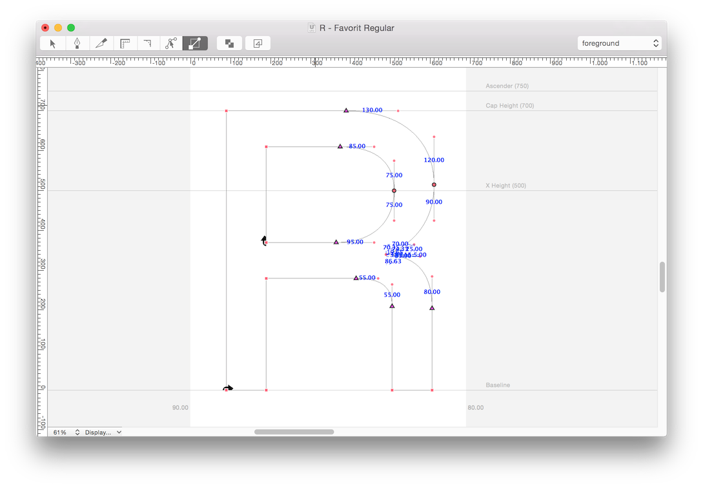
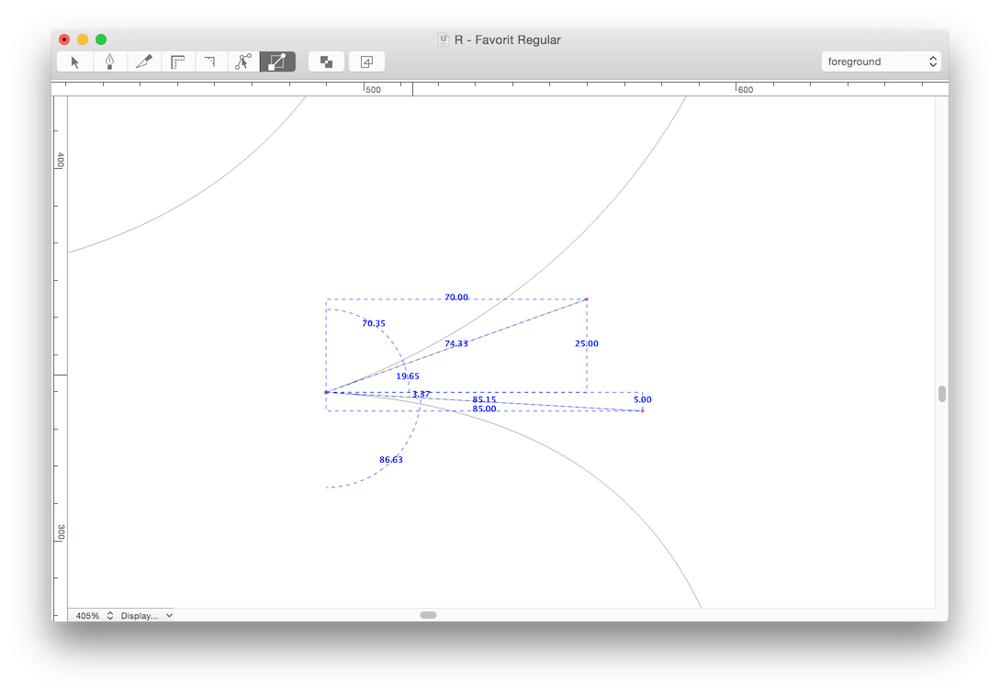

# Measure Handles Tool

A Robofont tool to display the length and angle of all bezier handles in the current glyph window.

## Credits

Idea by Johannes Breyer (of [Dinamo](http://dinamo.us/), together with Fabian Harb). Started as an exercise during the [pyftgd](http://pyftgd.org/) workshop in Berlin (August 2014), with guidance from [Joancarles Casasín](http://casasin.com/) and [Gustavo Ferreira](http://hipertipo.com/). Continued during 2015 by Gustavo and Johannes. Angles display feature requested by [Moshik Nadav](http://moshik.net/).

## How to use it

1. Run the script `build-extension.py` in RoboFont to build the file `MeasureHandles.roboFontExt`.
2. Double-click this file to install the extension. A new tool will be added to your RoboFont tools palette (available at the top of the Glyph Window).
3. Click the icon to activate the tool.

## To-Do

1\. add an additional Settings window with options to:

- pick colors for handles / box / angles
- individually turn on/off handles / box / angles
- individually turn on/off info for in- and outcoming handles

These options are already implemented in the code, but there's no UI for them yet.

2\. add an option to show info only for selected points?

3\. release as a RoboFont extension for activation with RF Mechanic

## License

[BSD 3-Clause License](http://www.opensource.org/licenses/BSD-3-Clause)
